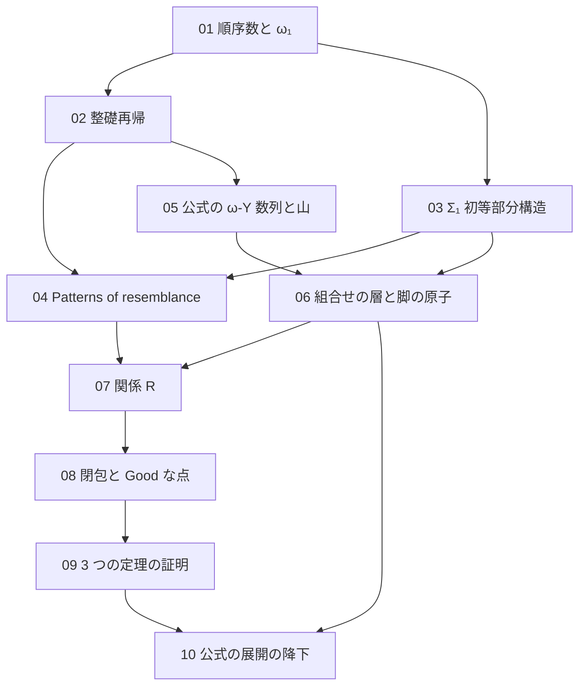

[← Back](../README.md) | [English](en/README.md) | [Japanese](README.md)

# study/

このリポジトリを読むための背景ノート。公式の ω-Y 数列の展開が整礎であることの証明を、定義と小さい例から書き起こす。

証明は 3 つの部分からなる。

- 意味の層：列に付けるラベル（$`\omega_1`$ 以下の順序数）の間の関係 $`R`$ を、$`\Sigma_1`$ 初等部分構造で定め、3 つの定理を示す（[07](07-relation-r.md)〜[09](09-obligations.md)）。
- 組合せの層：Phyrion 氏の証明のうち、関係 $`R`$ の 3 つの定理だけを使って、展開の整礎性を「分類」という有限の主張に帰着させる部分（[06](06-combinatorial-layer.md)）。公式の ω-Y のために、山の辺の代わりに「脚の原子」を使う。
- 分類の証明：公式の展開の規則（[05](05-omegay-mountain.md)）が、脚の原子の分類を満たすことの証明（[10](10-official-descent.md)）。

姉妹プロジェクトの study と同じ構成である。1-Y 版は [koteitan/1y-wo-por の study/](https://github.com/koteitan/1y-wo-por/tree/main/study)、weak-magma ω-Y 版は [koteitan/wmwy-wo-por の study/](https://github.com/koteitan/wmwy-wo-por/tree/main/study) にある。01〜04 と 07〜09 の数学は weak-magma ω-Y 版と同じである。05、06、10 は公式の ω-Y に特有の話である。

書き方は [rule.md](rule.md) に定める。

## 目次

| ノート | 内容 | このリポジトリでの対応箇所 |
|---|---|---|
| [01 順序数と ω₁](01-ordinals.md) | 整列順序、Cantor の標準形と次数、後者と極限、上限、可算、$`\omega_1`$ の正則性、ラベル、パラメータの数え方 | notes/00-survey.md §1.3、§3.2、notes/02-wmwy-design.md §3.3 |
| [02 整礎関係と整礎再帰](02-well-founded.md) | 整礎、到達可能、整礎帰納法、辞書式順序、鍵、段と上端、整礎再帰、ガードつきの再帰、ラベルの上界による停止 | notes/00-survey.md §3.2、notes/02-wmwy-design.md §2.3、notes/04-official-design.md §1.1 |
| [03 構造と Σ₁ 初等部分構造](03-sigma1-elementary.md) | 構造の書き方、$`\Sigma_1`$ 論理式、リテラル、$`\preccurlyeq_{\Sigma_1}`$、Tarski–Vaught 判定法、型板、内部の関係と上端の述語 | notes/02-wmwy-design.md §2.1、§2.2 |
| [04 Patterns of resemblance](04-patterns-of-resemblance.md) | Carlson の $`\le_1`$、有限反映の形、bms-elem-pattern、ω-Y で足りないもの、このリポジトリの変更点 | notes/00-survey.md §3.1〜§3.4、notes/02-wmwy-design.md §0 |
| [05 公式の ω-Y 数列と山](05-omegay-mountain.md) | 式、行と跳び、山と親、帯、展開の規則（根、項目、上がる列、根の行の写し、上の部分）、例、weak-magma ω-Y との違い、最終定理 | notes/00-survey.md §1、notes/01-feasibility.md §1.1、§2、notes/03-official-rule.md §1〜§6 |
| [06 組合せの層と脚の原子](06-combinatorial-layer.md) | 型板と鍵、原子と図式、尺度の根と辺の鍵、表現、3 つの定理、継ぎ合わせ、予備、分類と降下、山の辺では足りないこと、脚の原子 | notes/00-survey.md §3.2、§3.5、notes/01-feasibility.md §3、§4、notes/04-official-design.md §1〜§4 |
| [07 関係 R](07-relation-r.md) | 構造 $`\mathfrak A^c_\theta`$、$`R`$ の定義、（上端、鍵）の再帰、定義の式、$`a \lt b`$、鍵の弱化 | notes/02-wmwy-design.md §2、§3.1 |
| [08 ω₁ より下の閉包と Good な点の列](08-closure-chain.md) | Good、論理式が可算個であること、証人の高さ、閉包の 1 歩、塔と $`\lambda`$、Good な点が共終であること、Good な点の列 | notes/02-wmwy-design.md §3.3 |
| [09 3 つの定理の証明](09-obligations.md) | 有限反映、上端の述語の絶対性、Good な点どうしの関係、最初の表現 | notes/02-wmwy-design.md §1、§3、notes/04-official-design.md §1.1 |
| [10 公式の展開の降下](10-official-descent.md) | 出どころ、分類を 6 つの主張に分けること、制御の強さ、次数の保存、出力の山の再構成、鍵の上界、最終定理 | notes/04-official-design.md §5、§6、notes/05-large-value-audit.md §1、notes/06-final-assembly.md、README「状態」 |

## 読む順

