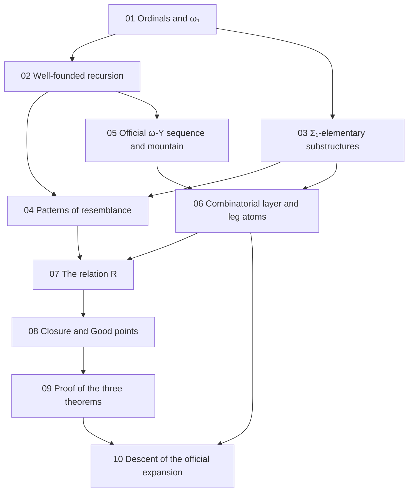

[← Back](../../README-en.md) | [English](README.md) | [Japanese](../README.md)

# study/

Background notes for reading this repository. They write out, from definitions and small examples, the proof that the expansion of the official ω-Y sequence is well-founded.

The proof has three parts.

- The semantic layer: the relation $`R`$ between the labels of columns (ordinals up to $`\omega_1`$) is defined by $`\Sigma_1`$-elementary substructures, and three theorems about it are proved ([07](07-relation-r.md)–[09](09-obligations.md)).
- The combinatorial layer: the part of Phyrion's proof that uses only the three theorems about $`R`$ and reduces well-foundedness of expansion to a finite statement called "the classification" ([06](06-combinatorial-layer.md)). For the official ω-Y it uses "leg atoms" instead of the edges of the mountain.
- The proof of the classification: the expansion rule of the official ω-Y ([05](05-omegay-mountain.md)) satisfies the classification of leg atoms ([10](10-official-descent.md)).

The structure is the same as the studies of the sister projects: the 1-Y study in [study/ of koteitan/1y-wo-por](https://github.com/koteitan/1y-wo-por/tree/main/study), and the weak-magma ω-Y study in [study/ of koteitan/wmwy-wo-por](https://github.com/koteitan/wmwy-wo-por/tree/main/study). The mathematics of 01–04 and 07–09 is the same as in the weak-magma ω-Y study. 05, 06 and 10 are specific to the official ω-Y.

The writing rules are fixed in [rule.md](rule.md).

## Contents

| Note | Topic | Where it is used in this repository |
|---|---|---|
| [01 Ordinals and ω₁](01-ordinals.md) | well-orders, Cantor normal form and degree, successors and limits, suprema, countability, regularity of $`\omega_1`$, labels, counting parameters | notes/00-survey.md §1.3, §3.2; notes/02-wmwy-design.md §3.3 |
| [02 Well-founded relations and recursion](02-well-founded.md) | well-founded, accessible, well-founded induction, lexicographic order, keys, stages and tops, well-founded recursion, guarded recursion, termination by bounds on labels | notes/00-survey.md §3.2; notes/02-wmwy-design.md §2.3; notes/04-official-design.md §1.1 |
| [03 Structures and Σ₁-elementary substructures](03-sigma1-elementary.md) | notation for structures, $`\Sigma_1`$ formulas, literals, $`\preccurlyeq_{\Sigma_1}`$, the Tarski–Vaught test, templates, internal relations and top predicates | notes/02-wmwy-design.md §2.1, §2.2 |
| [04 Patterns of resemblance](04-patterns-of-resemblance.md) | Carlson's $`\le_1`$, the shape of finite reflection, bms-elem-pattern, what is missing for ω-Y, the changes of this repository | notes/00-survey.md §3.1–§3.4; notes/02-wmwy-design.md §0 |
| [05 The official ω-Y sequence and its mountain](05-omegay-mountain.md) | expressions, rows and jumps, the mountain and parents, regions, the expansion rule (root, items, ascending columns, copies of the root row, the upper part), examples, the difference from weak-magma ω-Y, the final theorem | notes/00-survey.md §1; notes/01-feasibility.md §1.1, §2; notes/03-official-rule.md §1–§6 |
| [06 The combinatorial layer and leg atoms](06-combinatorial-layer.md) | templates and keys, atoms and diagrams, scale roots and edge keys, representations, the three theorems, splicing, reservoirs, classification and descent, why the edges of the mountain are not enough, leg atoms | notes/00-survey.md §3.2, §3.5; notes/01-feasibility.md §3, §4; notes/04-official-design.md §1–§4 |
| [07 The relation R](07-relation-r.md) | the structures $`\mathfrak A^c_\theta`$, the definition of $`R`$, the (top, key) recursion, the defining equation, $`a \lt b`$, weakening of keys | notes/02-wmwy-design.md §2, §3.1 |
| [08 Closure below ω₁ and the sequence of Good points](08-closure-chain.md) | Good, countably many formulas, heights of witnesses, one closure step, the tower and $`\lambda`$, Good points are cofinal, the sequence of Good points | notes/02-wmwy-design.md §3.3 |
| [09 Proof of the three theorems](09-obligations.md) | finite reflection, absoluteness of the top predicates, Good points are related, the initial representation | notes/02-wmwy-design.md §1, §3; notes/04-official-design.md §1.1 |
| [10 Descent of the official expansion](10-official-descent.md) | origins, splitting the classification into six statements, strength of the control, preservation of degree, reconstruction of the output mountain, the key bound, the final theorem | notes/04-official-design.md §5, §6; notes/05-large-value-audit.md §1; notes/06-final-assembly.md; README "Status" |

The notes in `notes/` are in Japanese.

## Reading order

